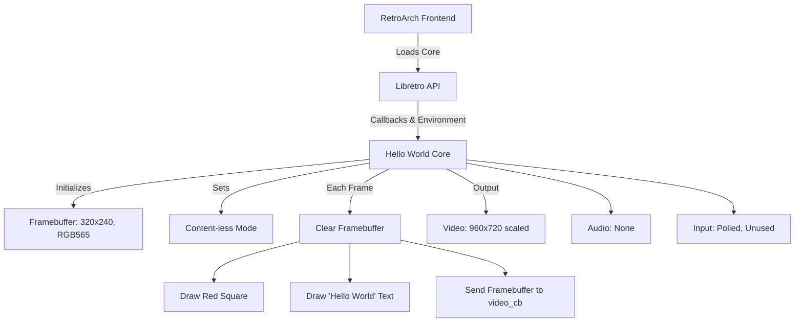

# libretro_hello_world_core

# License: MIT

# Information:
  Sample Hello hello Core test.

  Note this using library as core. Like helloworld_core.dll or helloworld_core.so.

  Windows test.

# CMake:
  Using the cmake to load core using dll to test logs and "hello world".

# run cmd:
```
retroarch.exe --verbose -L cores/hello_world_core.dll
```

# load core:
```
helloworld_core.dll
```
If there should be Start Core button once the core is loaded.

# Credits:
 * Grok 3.0

# Libretro Core API Documentation: Creating a "Hello World" Core

This document explains how to create a simple Libretro core, using the "Hello World" core as an example. It covers the Libretro API, setup instructions, and a visual diagram to clarify the interaction between the core and RetroArch. The goal is to help developers and users understand the core development process and how it integrates with RetroArch.

1. Introduction to Libretro and Cores

Libretro is an API that defines an interface for emulators, game engines, and other applications (called "cores") to run within frontends like RetroArch. A Libretro core is a dynamic library (.dll, .so, or .dylib) that implements the Libretro API to handle game logic, rendering, input, and audio.

The Hello World core is a minimal example that:
- Displays a red square moving horizontally across the screen.
- Renders the text "Hello World" at a fixed position.
- Runs without game content (content-less mode).
- Uses RGB565 pixel format, 320x240 resolution, and 60 FPS.

This core is ideal for learning the Libretro API basics, as it focuses on core functionality without complex emulation logic.

2. Libretro API Overview

The Libretro API is defined in libretro.h (available in the Libretro GitHub repository: https://github.com/libretro/libretro-common). It provides callbacks and functions for the core to communicate with the frontend (RetroArch). Below are the key components used in the Hello World core.

Key API Functions and Callbacks

1. Core-Provided Functions (Implemented by the core):
    - retro_init: Initializes the core (called once when the core is loaded).
    - retro_deinit: Cleans up resources when the core is unloaded.
    - retro_set_environment: Sets up the core’s environment, including supported features (e.g., content-less mode).
    - retro_set_video_refresh: Registers a callback to send video frames to the frontend.
    - retro_set_input_poll: Registers a callback to poll input states.
    - retro_set_input_state: Registers a callback to query input states.
    - retro_set_audio_sample: Registers a callback for single audio samples (not used in Hello World).
    - retro_set_audio_sample_batch: Registers a callback for batches of audio samples.
    - retro_load_game: Loads game content (or initializes content-less mode).
    - retro_unload_game: Unloads game content.
    - retro_run: Runs one frame of the core’s logic (called every frame).
    - retro_get_system_info: Provides metadata about the core (e.g., name, version).
    - retro_get_system_av_info: Provides audio/video information (e.g., resolution, FPS).
        
2. Frontend-Provided Callbacks (Set via retro_set_environment):
    - RETRO_ENVIRONMENT_SET_PIXEL_FORMAT: Sets the pixel format (e.g., RGB565).
    - RETRO_ENVIRONMENT_SET_SUPPORT_NO_GAME: Enables content-less mode.
    - RETRO_ENVIRONMENT_GET_LOG_INTERFACE: Retrieves a logging callback for debug messages.
3. Data Structures:
    - retro_system_info: Defines core metadata (name, version, supported extensions).
    - retro_system_av_info: Defines audio/video settings (geometry, FPS, sample rate).
    - retro_game_geometry: Specifies resolution and aspect ratio.
    - retro_framebuffer: Manages the core’s framebuffer for rendering.
        

Hello World Core Specifics

- Pixel Format: RGB565 (16-bit color).
- Resolution: 320x240.
- FPS: 60 Hz.
- Audio: 48000 Hz (not used in this example, but initialized).
- Input: Polls input but does not process it (stubbed).
- Rendering: Draws a red square and "Hello World" text to a framebuffer.

3. Setting Up the Hello World Core

This section provides step-by-step instructions to create, build, and run the Hello World core.

Prerequisites

- Development Environment:
    - C/C++ compiler (e.g., GCC, MSVC, or Clang).
    - CMake or Make for building the core.
    - Git for cloning the Libretro repository.
- Dependencies:
    - Libretro headers (libretro.h and related files from libretro-common).
    - RetroArch installed to test the core (download from https://www.retroarch.com/).
- Operating System: Windows, Linux, or macOS (instructions below assume Windows for consistency with the provided log).
    

Step 1: Clone the Libretro Sample Core

The Libretro team provides a sample core repository that includes the Hello World core.

bash

```bash
git clone https://github.com/Lightnet/libretro_hello_world_core.git
cd libretro_hello_world_core
```

The hello-world directory contains the source code for the Hello World core (hello_world_core.c).

Step 2: Understand the Core Code

Below is a simplified version of the Hello World core’s code (libretro.c), with comments explaining each part.

c

```c
#include <libretro.h>
#include <string.h>
#include <stdio.h>

// Global variables
static uint16_t *framebuffer; // Framebuffer for rendering
static int fb_width = 320, fb_height = 240; // Resolution
static int square_x = 0, square_dir = 1; // Red square position and direction
static retro_log_printf_t log_cb; // Logging callback

// Initialize the core
void retro_init(void) {
    framebuffer = (uint16_t *)calloc(fb_width * fb_height, sizeof(uint16_t));
}

// Clean up resources
void retro_deinit(void) {
    free(framebuffer);
    framebuffer = NULL;
}

// Set environment (called by frontend)
void retro_set_environment(retro_environment_t cb) {
    bool no_content = true;
    cb(RETRO_ENVIRONMENT_SET_SUPPORT_NO_GAME, &no_content); // Enable content-less mode
    cb(RETRO_ENVIRONMENT_SET_PIXEL_FORMAT, &(enum retro_pixel_format){RETRO_PIXEL_FORMAT_RGB565});
    cb(RETRO_ENVIRONMENT_GET_LOG_INTERFACE, &log_cb); // Get logging callback
}

// Register video callback
void retro_set_video_refresh(retro_video_refresh_t cb) { video_cb = cb; }

// Register input callbacks (stubbed for simplicity)
void retro_set_input_poll(retro_input_poll_t cb) {}
void retro_set_input_state(retro_input_state_t cb) {}

// Register audio callbacks (not used)
void retro_set_audio_sample(retro_audio_sample_t cb) {}
void retro_set_audio_sample_batch(retro_audio_sample_batch_t cb) {}

// Provide core metadata
void retro_get_system_info(struct retro_system_info *info) {
    memset(info, 0, sizeof(*info));
    info->library_name = "Hello World Core";
    info->library_version = "v1.0";
    info->need_fullpath = false;
    info->valid_extensions = NULL;
}

// Provide audio/video info
void retro_get_system_av_info(struct retro_system_av_info *info) {
    info->geometry.base_width = fb_width;
    info->geometry.base_height = fb_height;
    info->geometry.max_width = fb_width;
    info->geometry.max_height = fb_height;
    info->geometry.aspect_ratio = 4.0f / 3.0f;
    info->timing.fps = 60.0;
    info->timing.sample_rate = 48000.0;
}

// Load game (content-less mode)
bool retro_load_game(const struct retro_game_info *info) {
    log_cb(RETRO_LOG_DEBUG, "Game loaded (content-less): Displaying Hello World\n");
    return true;
}

// Unload game
void retro_unload_game(void) {}

// Draw a red square at (x, y)
static void draw_square(int x, int y) {
    for (int i = 0; i < 20; i++)
        for (int j = 0; j < 20; j++)
            if (x + i < fb_width && y + j < fb_height)
                framebuffer[(y + j) * fb_width + (x + i)] = 0xF800; // Red in RGB565
}

// Draw text (simplified; actual implementation may use a font)
static void draw_string(const char *str, int x, int y) {
    // Stub: In a real core, use a font rendering library
    log_cb(RETRO_LOG_DEBUG, "Drawing string: %s at (%d, %d)\n", str, x, y);
}

// Run one frame
void retro_run(void) {
    // Clear framebuffer
    memset(framebuffer, 0, fb_width * fb_height * sizeof(uint16_t));
    log_cb(RETRO_LOG_DEBUG, "Clearing framebuffer\n");

    // Draw red square
    draw_square(square_x, 0);
    log_cb(RETRO_LOG_DEBUG, "Drawing red square at (%d, 0)\n", square_x);

    // Draw "Hello World"
    draw_string("Hello World", 50, 50);

    // Update square position
    square_x += square_dir;
    if (square_x >= fb_width - 20 || square_x <= 0)
        square_dir = -square_dir;

    // Send framebuffer to frontend
    video_cb(framebuffer, fb_width, fb_height, fb_width * sizeof(uint16_t));
    log_cb(RETRO_LOG_DEBUG, "Framebuffer sent to video_cb\n");
}

// Global callbacks
static retro_video_refresh_t video_cb;

// Entry point
RETRO_API unsigned retro_api_version(void) { return RETRO_API_VERSION; }
```

Key Points:
- The core initializes a 320x240 framebuffer in retro_init.
- It sets up content-less mode and RGB565 pixel format in retro_set_environment.
- Each frame (retro_run) clears the framebuffer, draws a red square and text, and sends the frame to the frontend via video_cb.
- Input and audio are stubbed (not used in this example).

Step 3: Build the Core
1. Set Up Build Environment:
    - Install a C compiler (e.g., MSVC for Windows, GCC for Linux).
    - Install CMake (https://cmake.org/download/).
2. Build the Core:

    bash
    ```bash
    cd libretro-samples/hello-world
    mkdir build && cd build
    cmake ..
    cmake --build .
    ```
    
    This generates hello_world_core.dll (Windows) or equivalent for other platforms.
    
3. Verify the Output:
    - The compiled core is a dynamic library (e.g., hello_world_core.dll).

Step 4: Test the Core in RetroArch

1. Install RetroArch:
    - Download and install RetroArch from https://www.retroarch.com/.
    - Default installation path (as per your log): ...\RetroArch-Win64.
        
2. Place the Core:
    - Copy hello_world_core.dll to the cores directory (e.g., ...\RetroArch-Win64\cores).
        
3. Run the Core:
    - Launch RetroArch.
    - Go to Main Menu > Load Core and select "Hello World Core".
    - Go to Main Menu > Start Core (no content needed, as the core is content-less).
    - You should see a red square moving horizontally and "Hello World" text at (50, 50).
        
4. Verify Output:
    - Check the RetroArch log (enable logging in Settings > Logging) for messages like:
        
        ```text
        [libretro INFO] [DEBUG] Drawing red square at (x, 0)
        [libretro INFO] [DEBUG] Drawing string: Hello World at (50, 50)
        ```
        

Step 5: Debugging and Customization

- Enable Logging: Set log_verbosity = true and log_level = debug in retroarch.cfg to see detailed logs.
    
- Modify the Core:
    - Change the square’s color by modifying the RGB565 value in draw_square.
    - Adjust the resolution or FPS in retro_get_system_av_info.
    - Add input handling by implementing retro_set_input_poll and retro_set_input_state.
- Rebuild and Test: After changes, rebuild the core and reload it in RetroArch.
    
4. Visual Diagram

Below is a textual representation of the Libretro core architecture and its interaction with RetroArch. For a visual diagram, you can create one using tools like Draw.io or Mermaid (code provided below for Mermaid).

Textual Diagram Description

```text
[RetroArch Frontend]
   |
   | (Loads Core: hello_world_core.dll)
   |
   v
[Libretro API]
   | (Callbacks: retro_init, retro_run, retro_set_video_refresh, etc.)
   | (Environment: SET_PIXEL_FORMAT, SET_SUPPORT_NO_GAME)
   |
   v
[Hello World Core]
   | - Initializes framebuffer (320x240, RGB565)
   | - Sets up content-less mode
   | - Each frame:
   |   - Clears framebuffer
   |   - Draws red square (moving x position)
   |   - Draws "Hello World" text
   |   - Sends framebuffer to frontend via video_cb
   |
   v
[Output]
   - Video: 960x720 window (scaled from 320x240)
   - Audio: None (stubbed)
   - Input: Polled but unused
```

Mermaid Diagram Code

You can paste this into a Mermaid-compatible editor (e.g., https://mermaid.live/) to generate a visual diagram:

mermaid



Diagram Explanation:

- RetroArch Frontend: Loads the core and provides the Libretro API.
- Libretro API: Acts as the interface, passing callbacks and environment settings.
- Hello World Core: Implements the core logic, managing the framebuffer and rendering.
- Output: Displays the scaled video output, with no audio or input processing.
    

5. Additional Notes
- Extending the Core:
    - Add audio by implementing retro_set_audio_sample_batch to output sound.
    - Process input by querying states in retro_run using the input callback.
    - Support game content by implementing retro_load_game to load ROMs.
        
- Resources:
    - Libretro Documentation: https://docs.libretro.com/
    - Libretro Samples: https://github.com/libretro/libretro-samples
    - RetroArch Forums: https://forums.libretro.com/
        
- Troubleshooting:
    - If the core fails to load, check the RetroArch log for errors.
    - Ensure the core’s architecture (32-bit or 64-bit) matches RetroArch.
    - Verify the Libretro API version (RETRO_API_VERSION) matches RetroArch’s expectations.
        

6. Conclusion

The Hello World core is a minimal but effective example of a Libretro core, demonstrating the core API functions and interaction with RetroArch. By following the setup steps and understanding the code, users can create and test their own cores. The visual diagram clarifies the flow from frontend to core to output, making it easier to grasp the architecture. For further development, explore the Libretro documentation and sample cores to build more complex emulators or game engines.
