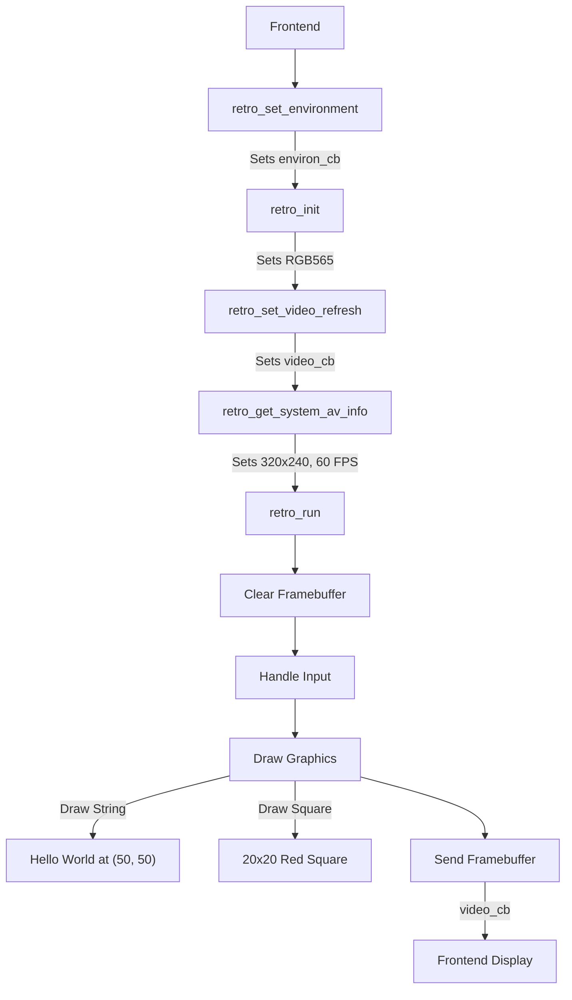

# Libretro API Setup and Rendering Documentation

This document explains how to set up rendering in a Libretro core using the Libretro API, based on the provided example code (lib.c). It includes a step-by-step guide on initializing the core, configuring the rendering pipeline, and rendering graphics to a framebuffer. A visual diagram is provided to illustrate the rendering flow.

## Table of Contents

1. Overview of Libretro Rendering (#overview-of-libretro-rendering)
2. Setup and Initialization (#setup-and-initialization)
    - Environment Callbacks (#environment-callbacks)
    - Core Initialization (#core-initialization)
    - Pixel Format Configuration (#pixel-format-configuration)
    - System and AV Information (#system-and-av-information)
3. Rendering Pipeline (#rendering-pipeline)
    - Framebuffer Setup (#framebuffer-setup)
    - Drawing Graphics (#drawing-graphics)
    - Rendering Loop (#rendering-loop)
4. Input Handling for Interactive Rendering (#input-handling-for-interactive-rendering)
5. Logging and Debugging (#logging-and-debugging)
6. Visual Diagram (#visual-diagram)
7. Key Functions and Callbacks (#key-functions-and-callbacks)
8. Best Practices (#best-practices)
    

---

## 1. Overview of Libretro Rendering

The Libretro API is a cross-platform interface for creating emulators, games, and multimedia applications (cores) that run within Libretro frontends like RetroArch. Rendering in a Libretro core involves:

- Setting up a framebuffer to hold pixel data.
- Configuring the pixel format and video output.
- Drawing graphics (e.g., shapes, text, or sprites) to the framebuffer.
- Passing the framebuffer to the frontend for display.

The example code implements a simple "Hello World" core that:

- Displays the text "Hello World" in white at coordinates (50, 50).
- Renders a movable 20x20 red square controlled by joypad inputs.
- Uses a 320x240 resolution framebuffer in RGB565 pixel format.
    

---

## 2. Setup and Initialization

### Environment Callbacks

The frontend provides callbacks to the core for environment interaction, video output, input polling, and logging. These are set during core initialization.

- retro_set_environment:
    - Called by the frontend to provide the retro_environment_t callback.
    - Configures core capabilities, such as content-less support (no ROM required).
    - Example: Enables content-less mode by calling RETRO_ENVIRONMENT_SET_SUPPORT_NO_GAME.
        
 c
```c
void retro_set_environment(retro_environment_t cb) {
	environ_cb = cb;
	bool contentless = true;
	if (environ_cb(RETRO_ENVIRONMENT_SET_SUPPORT_NO_GAME, &contentless)) {
		contentless_set = true;
		log_cb(RETRO_LOG_INFO, "[DEBUG] Content-less support enabled\n");
	}
}
```
    
- retro_set_video_refresh:
    - Sets the retro_video_refresh_t callback, used to send the framebuffer to the frontend.
    - Example: Stores the callback for use in retro_run.
    
c
```c
void retro_set_video_refresh(retro_video_refresh_t cb) {
	video_cb = cb;
	log_cb(RETRO_LOG_INFO, "[DEBUG] Video refresh callback set\n");
}
```
    

## Core Initialization

- retro_init:
    - Initializes the core, sets up the framebuffer, and configures the pixel format.
    - Clears the framebuffer and requests RGB565 format via RETRO_ENVIRONMENT_SET_PIXEL_FORMAT.
        
c
```c
void retro_init(void) {
	initialized = true;
	clear_framebuffer();
	enum retro_pixel_format fmt = RETRO_PIXEL_FORMAT_RGB565;
	if (environ_cb && environ_cb(RETRO_ENVIRONMENT_SET_PIXEL_FORMAT, &fmt)) {
		log_cb(RETRO_LOG_INFO, "[DEBUG] Pixel format set: RGB565\n");
	} else {
		log_cb(RETRO_LOG_ERROR, "[ERROR] Failed to set pixel format: RGB565\n");
		environ_cb(RETRO_ENVIRONMENT_SHUTDOWN, NULL);
	}
}
```
    
- Logging Setup:
    - Requests the logging interface via RETRO_ENVIRONMENT_GET_LOG_INTERFACE.
    - Falls back to file-based logging (core.log) if unavailable.
    
c
```c
struct retro_log_callback logging;
if (environ_cb && environ_cb(RETRO_ENVIRONMENT_GET_LOG_INTERFACE, &logging)) {
	log_cb = logging.log;
}
```


## Pixel Format Configuration

- The core specifies the pixel format for the framebuffer (e.g., RGB565, 16-bit color).
- RGB565 uses 5 bits for red, 6 for green, and 5 for blue, suitable for low-resource rendering.
- Example: Sets RGB565 in retro_init.
    
c
```c
enum retro_pixel_format fmt = RETRO_PIXEL_FORMAT_RGB565;
environ_cb(RETRO_ENVIRONMENT_SET_PIXEL_FORMAT, &fmt);
```


## System and AV Information

- retro_get_system_info:
    - Provides metadata about the core (e.g., library name, version).
    - Example: Specifies "Libretro Core Hello World" with no need for full file paths.
    
c
```c
void retro_get_system_info(struct retro_system_info *info) {
	info->library_name = "Libretro Core Hello World";
	info->library_version = "1.0";
	info->need_fullpath = false;
}
```
    
- retro_get_system_av_info:
    - Defines audio-video parameters: resolution (320x240), aspect ratio, and frame rate (60 FPS).
    - Example: Sets fixed 320x240 resolution and 60 FPS.
    
c
```c
void retro_get_system_av_info(struct retro_system_av_info *info) {
	info->geometry.base_width = WIDTH;
	info->geometry.base_height = HEIGHT;
	info->geometry.max_width = WIDTH;
	info->geometry.max_height = HEIGHT;
	info->geometry.aspect_ratio = (float)WIDTH / HEIGHT;
	info->timing.fps = 60.0;
}
```
    

---

## 3. Rendering Pipeline

Framebuffer Setup
- The framebuffer is a 1D array of uint16_t (RGB565 pixels) representing a 320x240 screen.
- Defined as: static uint16_t framebuffer[WIDTH * HEIGHT];.
- Cleared to black using memset in clear_framebuffer.
    
c
```c
static void clear_framebuffer() {
	memset(framebuffer, 0, WIDTH * HEIGHT * sizeof(uint16_t));
}
```
    

### Drawing Graphics

- Text Rendering:
    - Uses an 8x8 pixel font (font_8x8) to draw characters.
    - draw_char renders a single character by mapping font bitmap data to the framebuffer.
    - draw_string iterates over a string, calling draw_char for each character.
    - Example: Draws "Hello World" at (50, 50) in white.
    
c
```c
draw_string(50, 50, "Hello World", COLOR_WHITE);
```
    
c    
```c
static void draw_char(int x, int y, char c, uint16_t color) {
	const uint8_t *glyph = font_8x8[c - 32];
	for (int gy = 0; gy < 8; gy++) {
		for (int gx = 0; gx < 8; gx++) {
			if (glyph[gy] & (1 << (7 - gx))) {
				if (px >= 0 && px < WIDTH && py >= 0 && py < HEIGHT) {
					framebuffer[py * WIDTH + px] = color;
				}
			}
		}
	}
}
```
    
- Shape Rendering:
    - Draws a 20x20 red square at (square_x, square_y) by setting pixel values to COLOR_RED.
    - Example: Renders the square in retro_run.
    
c
```c
for (int y = 0; y < 20; y++) {
	for (int x = 0; x < 20; x++) {
		if (square_x + x < WIDTH && square_y + y < HEIGHT)
			framebuffer[(y + square_y) * WIDTH + (x + square_x)] = COLOR_RED;
	}
}
```

### Rendering Loop

- retro_run:
    - Called every frame (60 FPS) to update and render the scene.
    - Steps:
        1. Clears the framebuffer.
        2. Processes input to update square_x and square_y.
        3. Draws the red square and "Hello World" text.
        4. Sends the framebuffer to the frontend via video_cb.
    
c
```c
void retro_run(void) {
	clear_framebuffer();
	// Input handling
	if (input_state_cb(0, RETRO_DEVICE_JOYPAD, 0, RETRO_DEVICE_ID_JOYPAD_RIGHT)) {
		square_x += 1;
		if (square_x > WIDTH - 20) square_x = WIDTH - 20;
	}
	// Draw square
	for (int y = 0; y < 20; y++) {
		for (int x = 0; x < 20; x++) {
			if (square_x + x < WIDTH && square_y + y < HEIGHT)
				framebuffer[(y + square_y) * WIDTH + (x + square_x)] = COLOR_RED;
		}
	}
	// Draw text
	draw_string(50, 50, "Hello World", COLOR_WHITE);
	// Send framebuffer
	video_cb(framebuffer, WIDTH, HEIGHT, WIDTH * sizeof(uint16_t));
}
```

---

## 4. Input Handling for Interactive Rendering
- Input callbacks (retro_set_input_poll, retro_set_input_state) enable joypad input.
- In retro_run, the core checks joypad states (e.g., left, right, up, down) to move the red square.
- Example: Moves the square right when the right button is pressed.
    
c
```c
if (input_state_cb(0, RETRO_DEVICE_JOYPAD, 0, RETRO_DEVICE_ID_JOYPAD_RIGHT)) {
	square_x += 1;
	if (square_x > WIDTH - 20) square_x = WIDTH - 20;
}
```
    

---

## 5. Logging and Debugging

- The core uses log_cb (from RETRO_ENVIRONMENT_GET_LOG_INTERFACE) for logging.
- Falls back to core.log file if log_cb is unavailable.
- Logs key events (e.g., initialization, pixel format setup, rendering).
- Example: Logs framebuffer clearing.
    
c
```c
static void fallback_log(const char *level, const char *msg) {
	if (!log_file) {
		log_file = fopen("core.log", "w");
	}
	fprintf(log_file, "[%s] %s\n", level, msg);
	fflush(log_file);
}
```

---

## 6. Visual Diagram

Below is a textual representation of the rendering flow in the Libretro core. For a graphical diagram, you can visualize this using tools like Mermaid or Graphviz.

```text
[Frontend] --> [retro_set_environment] --> Sets environ_cb, content-less mode
    |
[retro_init] --> Initializes framebuffer, sets RGB565 pixel format
    |
[retro_set_video_refresh] --> Sets video_cb for rendering
    |
[retro_get_system_av_info] --> Defines 320x240, 60 FPS
    |
[retro_run (per frame)]
    |
    v
[Clear Framebuffer] --> memset(framebuffer, 0)
    |
[Handle Input] --> Updates square_x, square_y (joypad)
    |
[Draw Graphics]
    |--> [draw_string] --> "Hello World" at (50, 50)
    |--> [Draw Square] --> 20x20 red square at (square_x, square_y)
    |
[Send Framebuffer] --> video_cb(framebuffer, WIDTH, HEIGHT, pitch)
    |
[Frontend Display] --> Renders framebuffer to screen
```

Mermaid Diagram (Paste into a Mermaid-compatible editor, e.g., mermaid.live):

mermaid



---

## 7. Key Functions and Callbacks

| Function/Callback        | Purpose                                            | Example Usage                                |
| ------------------------ | -------------------------------------------------- | -------------------------------------------- |
| retro_set_environment    | Sets environment callback, configures core options | Enables content-less mode                    |
| retro_set_video_refresh  | Sets callback to send framebuffer to frontend      | Stores<br><br>video_cb                       |
| retro_init               | Initializes core, framebuffer, and pixel format    | Sets RGB565, clears framebuffer              |
| retro_get_system_av_info | Specifies resolution and frame rate                | Defines 320x240, 60 FPS                      |
| retro_run                | Main loop: updates, draws, and renders             | Draws square and text, calls<br><br>video_cb |
| draw_string              | Draws text using 8x8 font                          | Renders "Hello World"                        |
| video_cb                 | Sends framebuffer to frontend                      | video_cb(framebuffer, WIDTH, HEIGHT, pitch)  |

---

## 8. Best Practices

- Validate Callbacks: Check if callbacks (e.g., video_cb, environ_cb) are set before use to avoid crashes.
- Bounds Checking: Ensure pixel writes stay within framebuffer bounds (e.g., px < WIDTH).
- Efficient Rendering: Minimize framebuffer updates by only redrawing changed areas if possible.
- Logging: Use log_cb for debugging but avoid excessive logging in retro_run to maintain performance.
- Pixel Format: Choose RGB565 for simplicity, but support other formats (e.g., XRGB8888) if needed.
- Clean Shutdown: Reset state in retro_deinit and close resources (e.g., log_file).